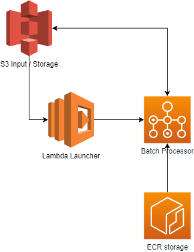

# Stable Diffusion Batch Jobs

> My wife won't let me buy a GPU, so I'll pay for one one hour at a time

The idea behind is that I should be able to upload parameters, have a message sent off to a lambda
and then have message sent to a batch job with a GPU to do my bidding. Easy enough, right?

Infrastructure looks a bit like this - very simple. Just upload an S3 file, get picked up by a Lambda
and then launched into a batch environment.

# Stages

The code will be built out in stages with each stage building on the previous one. Why? Well.... 
I have created many projects with the end goal in mind an failed miserably because I couldn't get the end goal on the
first try. That just doesn't work. So, we'll break it up into a series of small goals, each one having approximately the
same amount of work and each one being incrementally more useful. "Agile DevOps" if you must.

## Goal 0 - Running locally

This is a simple one - get the code running on my local computer. If I can't do that, I'll never get it running on a
batch job.

## Goal 1 - Get running on Docker Image

Keep the secrets secret of course, but need to get it running on a docker image. This is basically just the packaging of
Stable Diffusion into a Docker image. It ~should~ be relativly easy, but may have some big hurdles, espeically given the
massive size of the SD model.

## Goal 2 - Get running on Batch

Need to get the docker image onto AWS and running on batch. If we can do that, we'll be in a good position as everything
after this is just modifying what is already in place. Big question were - does batch have CUDA built in? Hmm.....
I have no idea.

## Goal 3 - Figure Out Automation Method

This should be relatively straight forward, but currently do not have a good path here. Will parameters be passed in?
Will the batch job download the input file? Who knows! Leaning towards having the batch job download the input file so
it can be expandable.

Need to outline what we are going to be implementing here - single creation and then multi creation would be a good
start.

## Goal 4 - Inplement File Reading

Implement the decisions made in Goal 3

## Goal 5 - Make more goals

If I get here, I'll have plent more goals to create.
